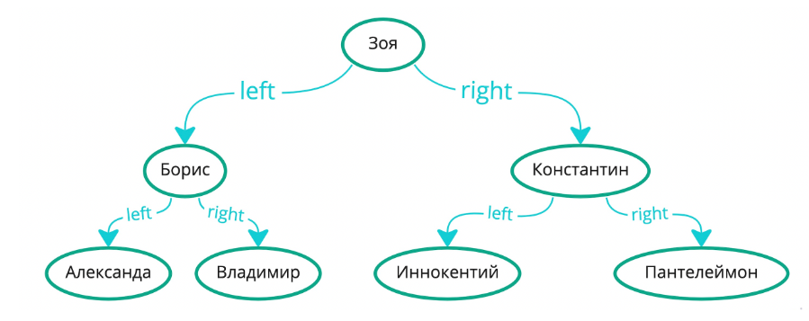
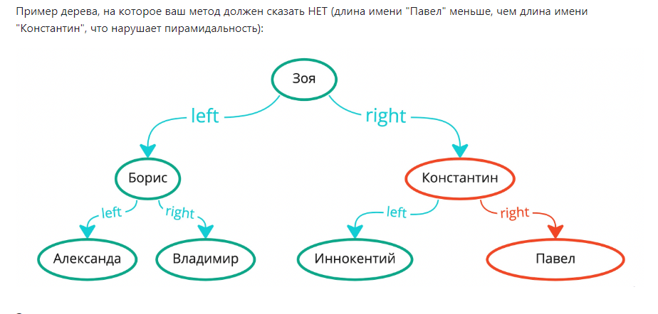

### "Пирамиды и деревья поиска"

Вам дана реализация бинарного дерева поиска на именах. Имена сравниваются в естественном (лексикографическом) 
порядке, т.е. как в словаре. В левом поддереве всегда лежат имена лексикографически меньшие (т.е. которые в 
словаре лежали бы раньше) чем то что находится в узле, а в правом - лексикографически большие.

Дерево при этом идеально сбалансировано, т.е. по структуре связей между узлами подошло бы и для пирамиды. Ваша 
задача как раз и состоит в том, чтобы проверить заданное дерево на min-пирамидальность по длине имён. Т.е. мы 
хотим проверить, что это дерево является пирамидой на минимум, если сравнение делать через сравнение длин 
имён. Ваш метод не должен перепроверять сбалансированность дерева и он может считать, что она уже 
гарантируется.

Пример дерева, на которое ваш метод должен сказать ДА:

### Алгоритм
Реализуйте проверку рекурсивным образом. Если в текущем узле не нарушается свойство пирамидальности с двумя 
его детьми (при их наличии), а также если каждый из существующих детей (left и right) отвечает на вопрос о 
своей пирамидальности своих поддеревьев ДА, то и ответ будет ДА. Если что-то из этого не соблюдается, то ответ 
будет НЕТ.